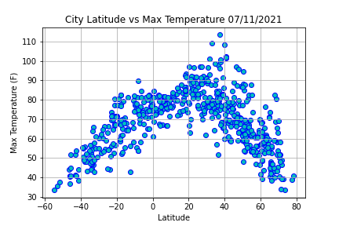

# Web-Design-Challenge

#### The purpose of this project was to analyze how the weather changes as we approach the equator. To answer this question we used a dataset of more than 500 cities across the world randomly selected using the Pyhton library citipy and the OpenWeatherMap API

 

#### As the next step Matplotlib library was used to plot various weather's aspects such as temperature, humidity, cloudiness and wind speed vs latitude. For the visualisation of the analysis we performed on the dataset we assembled this site to show comparison of the individual plots, also each weather elements are plotted with a short explanation of the results and full dataset with source data used in this project.